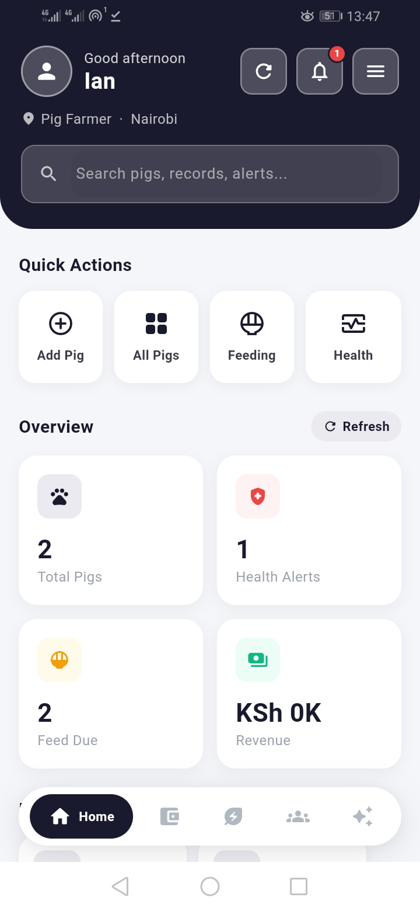
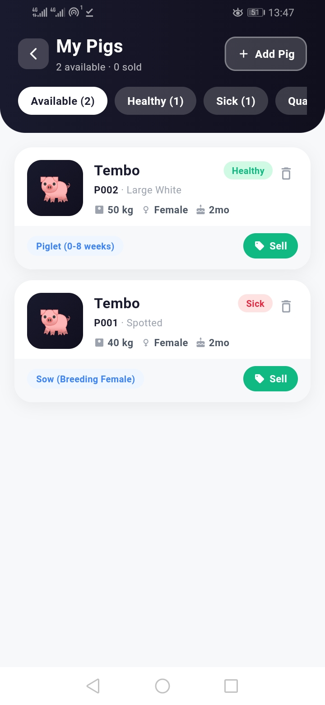
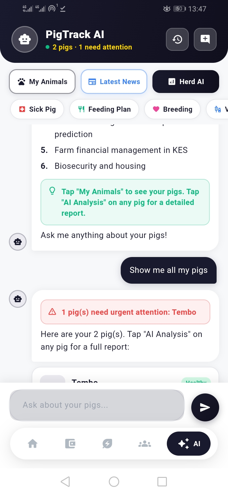

# PigTrack

PigTrack is a mobile-based Pig Management System developed using Flutter and Firebase to help pig farmers manage farm activities efficiently.

The system provides tools for:

- Pig registration and management
- Health monitoring
- Feeding management
- Growth tracking
- AI-based disease prediction
- Farmer community interaction
- Financial record management
- Veterinarian support system

---

## Project Information

- Project Name: PigTrack
- Developer: Ian Wanjohi Muthoni
- Institution: Meru University of Science and Technology
- Course: Bachelor of Science in Information Technology

---

## Technologies Used

- Flutter
- Dart
- Firebase
- TensorFlow Lite
- Android Studio

---

## Features

### User Authentication
- User registration
- Secure login system

### Pig Management
- Add pigs
- View pig profiles
- Manage pig records

### Health Records
- Store symptoms
- Vaccination tracking
- Treatment history

### Feeding Management
- Feeding schedules
- Feeding history

### Growth Tracking
- Weight tracking
- Pig growth monitoring

### AI Disease Prediction
- Predict possible disease outbreaks
- Risk alerts and monitoring

### Community Module
- Farmer collaboration
- Ask questions
- Veterinarian interaction

### Financial Records
- Income tracking
- Expense management
- Profit summaries

---

# Download APK

Download the latest PigTrack APK below:

[Download PigTrack APK](./apk/app-release.apk)

---

# Screenshots

## Dashboard

---

## Pig Management

---

## AI Disease Prediction

---

# Installation

1. Download the APK
2. Install the application on Android
3. Allow installation from unknown sources if prompted
4. Open the app and start using PigTrack

---

# Repository

GitHub Repository:

https://github.com/ian30-msoo/pig-management-system

---

# Future Improvements

- Offline functionality
- Better AI prediction models
- Push notifications
- Veterinary integration
- Multi-livestock support

---

# Author

Ian Wanjohi Muthoni
